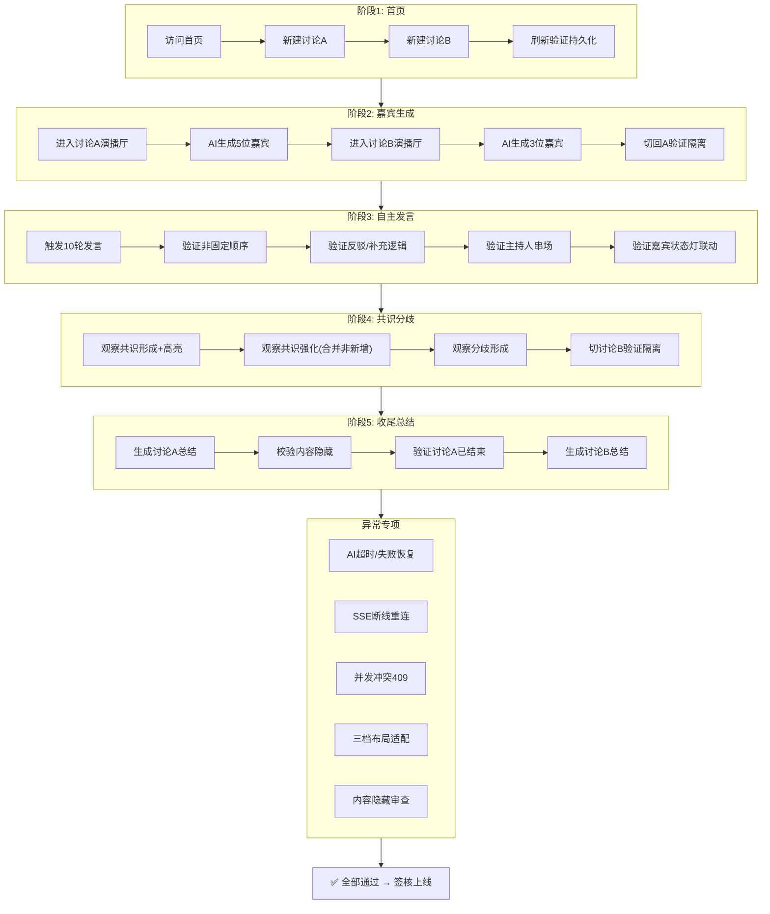

# AI Panel Studio — 端到端全流程验收方案

> 只输出测试步骤和验收标准，不写自动化脚本。
> 每条用例分三列：用户操作 → 后端校验 → 页面视觉校验。

---

## 一、核心全流程（Happy Path）

### 阶段 1：首页 → 新建圆桌

| # | 用户操作 | 后端校验 | 页面视觉校验 |
|---|---|---|---|
| 1.1 | 打开浏览器，访问首页 `/` | — | 页面显示 Logo + 标题"AI Panel Studio"；若无历史讨论，显示空态引导文案"创建你的第一场圆桌讨论" |
| 1.2 | 点击「新建圆桌」按钮 | — | 弹出 Modal，标题栏文案"新建圆桌讨论"；背景半透明遮罩；聚焦在标题输入框 |
| 1.3 | 输入标题"AI 监管应由政府主导还是行业自律？"，议题栏留空，点击「创建」 | `POST /discussions` 返回 201；`discussions` 表新增一行，`status=active`，`created_at` 非空 | Modal 关闭；卡片列表顶部出现新卡片，显示标题、状态标签"进行中"（绿色）、嘉宾数 0、发言数 0 |
| 1.4 | 再创建第二场讨论，标题"量子计算何时落地商用？"，议题填"探讨量子计算产业化时间表" | `POST /discussions` 返回 201；新 discussion_id 与第一场不同 | 卡片列表显示两张卡片，按创建时间倒序（新的在上），第二张卡片显示议题摘要（一行省略） |
| 1.5 | 刷新页面 | `GET /discussions` 返回 2 条记录，状态、数量均与刷新前一致 | 两张卡片仍在，顺序不变，数据无丢失 |

**阶段 1 通过标准**：两场讨论独立创建成功，刷新后数据持久化，卡片信息正确。

---

### 阶段 2：生成嘉宾阵容

| # | 用户操作 | 后端校验 | 页面视觉校验 |
|---|---|---|---|
| 2.1 | 点击第一场讨论卡片，进入 `/studio/42` | `GET /discussions/42` 返回讨论详情；`GET /discussions/42/panelists` 返回空列表 | 演播厅页加载，左栏显示空态"暂无嘉宾，请先生成阵容"；中栏空态"讨论即将开始"；右栏空态 |
| 2.2 | 点击左栏「生成嘉宾」按钮，弹出人数选择器，选择 5 人，确认 | `POST /discussions/42/panelists/generate {count:5}` 返回 201；`panelists` 表插入 5 行，1 host + 4 expert，每人的 stance/title/color 互不相同 | 左栏渲染 5 个嘉宾小窗，主持人置顶带橙色边框；每人有姓名、头衔、ColorBadge、StatusIndicator（灰色待机）；无重复颜色 |
| 2.3 | 切换到第二场讨论 `/studio/43` | `GET /discussions/43/panelists` 返回空（隔离验证） | 第二场的左栏、中栏、右栏全部为空态，**不出现第一场的任何嘉宾数据** |
| 2.4 | 在第二场也生成 3 位嘉宾 | `POST /discussions/43/panelists/generate {count:3}` 返回 201，3 人颜色与第一场无必然关联 | 第二场嘉宾正常显示 |
| 2.5 | 切回第一场 `/studio/42` | — | 第一场 5 位嘉宾仍在，数据无串扰，颜色、立场与之前一致 |

**阶段 2 通过标准**：两场讨论嘉宾独立生成、独立展示，切换不串数据；每位嘉宾立场/颜色/头衔唯一；主持人置顶。

---

### 阶段 3：进入演播厅 → 开始发言

| # | 用户操作 | 后端校验 | 页面视觉校验 |
|---|---|---|---|
| 3.1 | 在第一场讨论页，点击「开始讨论」或「下一轮发言」按钮 | `POST /discussions/42/speeches/next` 返回 202 `accepted:true`；后端调用 DeepSeek 生成发言 | 按钮变为灰色"生成中…"；SseStatusBar 显示绿色"已连接"；中栏底部出现灰色闪烁打字机文本（`speech.chunk`） |
| 3.2 | 等待 AI 生成 | SSE 推送多个 `speech.chunk` 事件，delta 逐 token 累加；最后推送 `speech.complete`，speeches 表新增 1 行，`sequence_num=1`，`panelist_id=host.id` | 中栏底部打字机效果持续；最终一条完整发言卡片从下方滑入（slideUp 动画），左侧带主持人专属色条，显示姓名 + 内容 + 时间"刚刚" |
| 3.3 | 观察左栏嘉宾状态 | — | 主持人的 StatusIndicator 在 AI 生成期间切换为绿色呼吸"正在发言"，发言完成后 2 秒切回灰色"待机" |
| 3.4 | 再次点击「下一轮发言」 | `POST .../next` 202；speeches 表 +1，`sequence_num=2`，panelist_id 为某位 expert（非 host） | 新发言卡片滑入，左栏对应嘉宾指示灯变绿 → 发言完毕变灰；主持人本轮未发言，指示灯保持灰色 |
| 3.5 | 连续点击「下一轮」，观察 10 轮 | speeches 表 sequence_num 连续递增 1→10，无跳号；panelist_id 不出现同一人连续 ≥3 次；每条 content 在 20~200 字之间 | 中栏 10 条发言按时间线排列，每条色条颜色与发言人一致；不存在同一颜色的色条连续出现 3 次以上 |
| 3.6 | 观察反驳场景 | 后端保证存在立场冲突的嘉宾先后发言时，后者的 content 含"但是""然而""不认同"等转折逻辑词 | 中栏发言内容通顺自然，有辩论感，不像固定模板 |
| 3.7 | 观察主持人串场 | 专家连续发言 4 次后，第 5 次发言 panelist_id 应为 host | 中栏主持人发言卡片有橙色边框区分；内容概括了前几位的观点并引导下一位 |

**阶段 3 通过标准**：发言按非固定顺序推送、长度合规、有辩论逻辑、主持人适时串场；SSE 流式输出打字机效果正常；嘉宾指示灯状态联动正确。

---

### 阶段 4：共识分歧实时刷新

| # | 用户操作 | 后端校验 | 页面视觉校验 |
|---|---|---|---|
| 4.1 | 保持观察右栏，触发第 3~4 轮发言 | 首次出现两位专家立场相近时，consensus_points 表新增 1 行；SSE 推送 `consensus.update` | 右栏共识区新增 1 条卡片，**背景色从品牌色渐变消退（2s 高亮动画）**，然后恢复常态 |
| 4.2 | 继续触发发言 | 若下一位专家强化该共识，同一 consensus 行 `updated_at` 更新，`content` 追加新观点，**不新增行** | 该共识卡片停留原位，内容文字变长，再次触发 2s 高亮动画 |
| 4.3 | 观察分歧形成 | 立场冲突的发言出现后，divergence_points 表新增 1 行；SSE 推送 `divergence.update` | 右栏分歧区新增 1 条卡片，同样触发高亮动画；`sides` 字段明确标注各方立场和人数 |
| 4.4 | 暂停触发发言，手动滚动共识/分歧区 | — | 共识区与分歧区各自独立滚动，不拖动中栏发言区；每个条目 topic 粗体显示，更新时间显示为相对时间 |
| 4.5 | 再触发 5 轮发言 | 共识和分歧随每次发言持续更新；不存在重复 topic 的条目；同 topic 只更新、不新增 | 右栏条目数量 ≤ 独立 topic 数；不会因为 10 轮发言就出现 10 条重复共识 |
| 4.6 | 在第二场讨论 `/studio/43` 也触发几轮发言 | 第二场的 consensus_points 和 divergence_points 的 discussion_id 全部 = 43；第一场的 discussion_id 全部 = 42 | 切换到第二场，右栏共识/分歧全是第二场的数据；切回第一场，右栏仍是第一场的数据 |

**阶段 4 通过标准**：共识分歧随发言实时更新，不等整场结束；重复观点自动合并；高亮动画 2s 消退；两场讨论数据完全隔离。

---

### 阶段 5：收尾总结

| # | 用户操作 | 后端校验 | 页面视觉校验 |
|---|---|---|---|
| 5.1 | 在第一场讨论中，发言已达到一定数量后，点击「结束讨论并生成总结」 | `POST /discussions/42/summary` 返回 200；后端调用 DeepSeek，基于全部 speeches + consensus + divergence 生成 Markdown 总结；discussions 表该行 `status` 更新为 `completed` | 中栏底部出现一条主持人收尾发言卡片（如最后一条不是主持人发言则先生成收尾发言再总结）；随后弹出总结面板或以新区域展示 Markdown 渲染后的总结全文 |
| 5.2 | 检查总结内容 | 总结 content 包含：核心共识（列表）、主要分歧（列表）、后续建议（段落）；不包含 JSON 结构、prompt 原文、模型名称 | 总结以标题、列表、段落清晰排版；无 `{` `}` JSON 痕迹；无 "DeepSeek" "system prompt" 等字样；无嘉宾的完整 stance 原文照抄 |
| 5.3 | 尝试再次点击「下一轮发言」 | 返回 400 `DISCUSSION_COMPLETED` | 按钮置灰不可点击，hover 提示"讨论已结束" |
| 5.4 | 返回首页 `/` | `GET /discussions` 返回的第一场 status 变为 `completed` | 第一场卡片的状态标签变为灰色"已结束" |
| 5.5 | 对第二场讨论也生成总结 | 第二场总结正常生成，不影响第一场已有总结 | 第二场总结内容完全基于第二场自身的发言数据 |

**阶段 5 通过标准**：总结内容完整、格式正确、不含 AI 内部信息；讨论状态正确流转；两场总结独立。

---

## 二、四大重点校验项

### 2.1 多场圆桌数据隔离（专项验证）

| # | 操作 | 校验方法 | 通过标准 |
|---|---|---|---|
| I1 | 同时打开两个浏览器标签页：标签 A 加载 `/studio/42`，标签 B 加载 `/studio/43`；在标签 A 连续触发发言 | 在标签 B 的 Network 面板中，不应该出现 discussion_id=42 的 SSE 事件或 API 响应 | 标签 B 的嘉宾列表、发言列表、共识分歧均不变 |
| I2 | 标签 A 生成 5 位嘉宾，标签 B 生成 3 位嘉宾 | 直接查 SQLite：`SELECT discussion_id, COUNT(*) FROM panelists GROUP BY discussion_id` | 分别返回 5 和 3，无交叉 |
| I3 | 标签 A 触发 10 轮发言 | `SELECT discussion_id, COUNT(*) FROM speeches GROUP BY discussion_id` | 42 有 N 条，43 有 M 条，各自独立 |
| I4 | 两个标签分别生成总结 | `SELECT discussion_id, COUNT(*) FROM consensus_points GROUP BY discussion_id`；divergence_points 同理 | 全部子表 discussion_id 互不交叉 |
| I5 | 删除讨论 42 | `SELECT COUNT(*) FROM panelists WHERE discussion_id=42` 应为 0；discussion_id=43 的数据不受影响 | 级联删除只作用于目标讨论，不波及其他 |

**隔离验收标准**：5 张表（discussions / panelists / speeches / consensus_points / divergence_points）的任意查询加上 `WHERE discussion_id = ?` 后，永远只返回该场讨论的数据，零交叉污染。

---

### 2.2 SSE 实时推送（专项验证）

| # | 操作 | 校验方法 | 通过标准 |
|---|---|---|---|
| R1 | 打开演播厅页面，检查 Network 面板 | 存在一个 `text/event-stream` 类型的请求，状态为 `200 OK` 且持续 pending | EventSource 连接建立成功 |
| R2 | 不刷新页面，触发 1 次「下一轮发言」 | 在浏览器的 EventStream 标签中观察事件列表 | 依次出现：`speech.chunk` × N → `speech.complete` × 1 → `consensus.update` 和/或 `divergence.update`；事件之间无多余 `page reload` |
| R3 | 连续触发 3 次发言 | 中栏发言列表自动增长，每次新增一张卡片 | 全程无手动刷新页面；新卡片带入场动画 |
| R4 | 手动断开网络（Chrome DevTools → Network → Offline） | — | SseStatusBar 变为红色"已断开"；30 秒内页面不崩溃、不白屏 |
| R5 | 恢复网络（切换到 Online） | EventSource 自动重连或前端触发重连；支持 `?after_sequence=` 参数补拉断开期间的发言 | SseStatusBar 恢复绿色；中栏补上断开期间遗漏的发言卡片 |
| R6 | 15 秒不触发任何发言 | SSE 推送 `event: heartbeat` 空 data | 前端无可见变化（心跳对用户透明），连接保持不断 |
| R7 | SSE 连接超过 5 分钟 | 连接未断开，无内存泄漏（浏览器 Tab 内存稳定，不持续增长） | 长时间讨论场景可用 |

**SSE 验收标准**：所有发言、共识、分歧的内容变更均通过 SSE 推送到前端，用户在任何时间点看到的页面状态与实际数据库状态一致（最终一致性，延迟 < 3 秒）。

---

### 2.3 内容隐藏（专项验证）

| # | 检查对象 | 检查方法 | 通过标准 |
|---|---|---|---|
| H1 | 发言卡片正文 | 肉眼检查中栏全部 SpeechCard 的 content 文本 | 全部是通顺的中文对话；无 `{ "role": "assistant" }`、无 `"content"` 等 JSON 结构；无 `system:` `user:` 等 prompt 标签；无 "DeepSeek" "deepseek" "openai" 等模型名称 |
| H2 | 共识/分歧卡片 | 肉眼检查右栏全部 ConsensusItem / DivergenceItem 的 content 和 topic | 自然语言描述；无 JSON 原始结构；无 `"topic"` `"content"` 等字段名暴露 |
| H3 | 总结面板 | 肉眼检查 Markdown 渲染后的总结全文 | 报告式行文，无 prompt 指令残留；无 `<｜end▁of▁thinking｜>` 等模型输出标记 |
| H4 | 浏览器 Network 面板 | 检查所有 API 响应体和 SSE 事件 data | 可以包含结构化 JSON（这是 API 契约），但 JSON 的 **value** 部分——即发言正文、共识内容——不包含 AI 元数据 |
| H5 | 浏览器 Console 面板 | 检查是否有 `console.log` 输出 DeepSeek 原始响应 | 生产构建不应有原始响应日志；开发模式下可以有 `[DEBUG]` 前缀的日志但默认关闭 |
| H6 | 页面 HTML 源代码 | 查看 → 开发者工具 → Elements，搜索 "DeepSeek" "prompt" "system" "raw" | 0 条匹配 |
| H7 | 报错场景 | 故意触发 DeepSeek 不可用，检查页面错误提示 | 错误提示为"服务暂时不可用，请稍后重试"，不暴露 API 端点、密钥片段、模型名称、原始错误堆栈 |

**内容隐藏验收标准**：用户在任何 UI 位置（页面正文、弹窗、控制台、网络面板响应体、HTML 源码）都看不到大模型原始交互信息。页面只呈现"嘉宾说的话"——就像真人圆桌讨论一样自然。

---

### 2.4 布局适配（专项验证）

| # | 视口尺寸 | 操作 | 通过标准 |
|---|---|---|---|
| L1 | 2560×1440（宽屏） | 打开演播厅页，生成 5 位嘉宾并触发 10 轮发言 | 三栏并排：左 20% / 中 50% / 右 30%；每栏各自独立滚动条；滚动中栏不影响左右栏位置 |
| L2 | 2560×1440 | 左栏嘉宾超过屏幕高度时 | 左栏出现纵向滚动条，向下滚动可看到全部嘉宾，主持人始终可见（sticky 置顶） |
| L3 | 2560×1440 | 右栏共识+分歧总高度超过屏幕时 | 右栏出现纵向滚动条，共识区和分歧区在同一滚动容器内，分区标题 sticky 置顶 |
| L4 | 1920×1080（标准桌面） | 同上 | 三栏比例适配，无横向滚动条，所有文字可读 |
| L5 | 1366×768（小笔记本） | 同上 | 三栏仍可见，内容不溢出，滚动条正常 |
| L6 | 1024×768（平板横屏） | 触发断点切换 | 切换为双栏布局：上排左栏 + 中栏，下排右栏（横向滚动卡片）；无内容丢失 |
| L7 | 768×1024（平板竖屏） | 同上 | 双栏布局，同 L6 |
| L8 | 375×812（手机竖屏，iPhone X 尺寸） | 打开演播厅页 | 单栏 Tab 布局：顶部三 Tab"嘉宾 / 对话 / 共识分歧"；默认显示"对话"Tab；底部 FAB 按钮"下一轮" |
| L9 | 375×812 | 点击"嘉宾"Tab | 切换为嘉宾列表，竖向排列，每个小窗高度 ≤ 80px；点击"对话"Tab 切回发言时间线 |
| L10 | 375×812 | 点击"共识分歧"Tab | 切换为共识/分歧列表，分区标题可折叠 |
| L11 | 375×812 | 点击右下角 FAB「下一轮」 | 按钮触发发言后，自动切换到"对话"Tab 查看打字机效果 |
| L12 | 375×812 | 旋转为横屏 812×375 | 自动切换为双栏布局（左嘉宾 + 右对话/共识），不保持竖屏单栏 |
| L13 | 所有尺寸 | 通过 `devicePixelRatio` 缩放（125%、150%） | 布局不错位，文字不模糊，滚动条正常 |
| L14 | 所有尺寸 | 检查任一页面 | **整页不出现外层纵向滚动条**；只有三栏（或 Tab 内容区）各自内部有滚动条 |

**布局验收标准**：三种断点下，页面 body 永远 `overflow: hidden`（无整页滚动）；三栏各自独立滚动；手机端 Tab 切换不丢状态；FAB 按钮不遮挡内容。

---

## 三、异常场景测试

### 3.1 大模型调用失败

| # | 异常场景 | 模拟方式 | 前端预期行为 | 后端预期行为 |
|---|---|---|---|---|
| E-AI-1 | DeepSeek 生成嘉宾超时 | Mock 30s 延迟无响应 | 弹窗内显示 loading 动画 → 30s 后弹出 Toast "生成超时，请重试"；弹窗不关闭，可再次点击生成 | 返回 502 `AI_SERVICE_UNAVAILABLE`；panelists 表无新增数据；日志记录超时 |
| E-AI-2 | DeepSeek 生成发言中途断开 | Mock SSE 推送 3 个 chunk 后断开 | 中栏打字机文本消失，SseStatusBar 变红，已有 chunk 不入库（不显示半截发言）；Toast "发言生成中断"；"下一轮"按钮恢复可点击 | speeches 表无新增（原子性：失败不入库）；sequence_num 不递增 |
| E-AI-3 | DeepSeek 返回空发言 | Mock 返回 content="" | 同 E-AI-2，不显示空白发言卡片 | 空发言不入库；推送 SSE `event: error`；日志告警 |
| E-AI-4 | DeepSeek 返回格式非法（生成嘉宾时） | Mock 返回 `{"persons": [...]}` 缺少 stance 字段 | Toast "生成失败，请重试"；弹窗不关闭 | 返回 500 或重试后 502；不写入不完整 panelist 行 |
| E-AI-5 | DeepSeek API key 过期或无效 | 后端环境变量 DEEPSEEK_API_KEY 设为无效值 | 所有 AI 功能均不可用，但错误提示统一为"服务暂不可用" | 所有 AI 端点返回 502；日志记录认证失败详情（仅后端可见） |
| E-AI-6 | DeepSeek 生成共识分析时超时 | 发言已落库，但后续分析超时 | 发言卡片正常显示；共识/分歧区不更新（保持旧状态）；Toast "共识分析未完成" | speech 已落库不受影响；consensus/divergence 不更新；不阻塞后续发言触发 |

### 3.2 用户异常操作

| # | 异常场景 | 操作步骤 | 前端预期行为 | 后端预期行为 |
|---|---|---|---|---|
| E-USR-1 | 在发言生成中关闭标签页 | 触发 `next` 后立即关闭标签页 | — | 该次生成任务被取消或自然超时；SSE 连接断开；speeches 表不写入不完整数据 |
| E-USR-2 | 在发言生成中切换到另一讨论 | 标签 A 正在生成发言，切换到标签 B（`/studio/43`）并触发发言 | 标签 A 的生成不受影响（各自独立的 SSE 连接）；标签 B 正常生成 | 两个讨论独立处理，互不影响；各自 SSE 连接独立 |
| E-USR-3 | 快速连续点击「下一轮」5 次 | 在 1 秒内点击 5 次 | 第一次点击后按钮变灰"生成中…"，后续 4 次点击无响应（前端防抖） | 第一次返回 202；后续 4 次（如前端未拦截）返回 409 `SPEECH_IN_PROGRESS` |
| E-USR-4 | 浏览器后退 → 前进 | 在演播厅页点浏览器后退到首页，再前进回来 | 前进后回到演播厅页，之前的发言列表和嘉宾阵容还在（内存缓存），SSE 自动重连 | 数据无丢失；重连后补推增量 |
| E-USR-5 | 手动刷新演播厅页（F5） | 在讨论进行中按 F5 | 页面重新加载，从后端拉取所有已有的 speeches + panelists + consensus + divergence；SSE 重新连接，`after_sequence` 参数使用最后一条 speech 的 sequence_num | 返回完整历史数据；SSE 从断点之后推送 |
| E-USR-6 | 删除了正在发言的嘉宾 | 在 A 发言生成过程中，通过 API 删除该嘉宾 | panelist 被删除，但其已落库的发言保留（panelist_id 置 NULL）；正在生成的发言若未完成则取消 | panelists 表该行删除；speeches 表 panelist_id 置 NULL；级联清理符合外键约束 |
| E-USR-7 | 浏览器不支持 EventSource | 用 IE11 打开演播厅页 | 降级为轮询（每隔 3s GET /speeches）或显示"浏览器版本过低"提示 | 无需处理（SSE 降级在前端） |

### 3.3 边界与并发

| # | 异常场景 | 操作步骤 | 前端预期行为 | 后端预期行为 |
|---|---|---|---|---|
| E-CON-1 | 同一用户同时打开同一讨论的两个标签页 | 两个标签页都连 `/stream` | 两个标签页都收到相同的 SSE 事件推送 | 两个独立的 SSE 连接（无状态冲突）；speeches 表数据一致 |
| E-CON-2 | 同一用户两个标签页同时触发发言 | 标签 A 和标签 B 几乎同时点击「下一轮」 | 一个返回 202，另一个收到 409 后 Toast "已有发言生成中" | 只处理第一个请求，第二个返回 409；同讨论同一时间只有一条发言在生成 |
| E-CON-3 | 100 人同时使用不同讨论 | 压测：100 个不同 discussion_id 同时触发发言 | 各自独立推送，无串扰 | 100 条发言分别入库，discussion_id 互不交叉；平均延迟 < 5s |
| E-CON-4 | 讨论长度达到 500 条发言 | 持续触发发言至 sequence_num=500 | 中栏滚动流畅（虚拟列表，不卡顿）；右栏共识分歧正常更新 | speeches 表 500 行查询正常（索引生效）；无慢查询 |
| E-CON-5 | 空数据库首次启动 | 删除 SQLite 文件后重启服务 | 首页显示空态引导，无报错；新建讨论功能正常 | 自动建表（SQL 含 CREATE TABLE IF NOT EXISTS） |

---

## 四、上线验收标准文档

### 4.1 功能完整性检查表

| 序号 | 检查项 | 验收标准 | 状态 |
|---|---|---|---|
| F-01 | 首页讨论列表 | 可查看所有讨论，按更新时间倒序；分页正常 | ☐ |
| F-02 | 新建讨论 | 输入标题（必填）+ 议题（选填）后创建成功，卡片列表即时刷新 | ☐ |
| F-03 | 删除讨论 | 确认后级联删除该讨论所有数据，其他讨论不受影响 | ☐ |
| F-04 | 修改讨论状态 | 可暂停/恢复/结束讨论，状态标签颜色正确联动 | ☐ |
| F-05 | AI 生成嘉宾 | 1~10 人范围正常，立场/颜色/职业唯一；生成失败有明确错误提示 | ☐ |
| F-06 | 手动添加/修改/删除嘉宾 | CRUD 正常，数据持久化 | ☐ |
| F-07 | 主持人开场 | 首次 `next` 由 host 发言，内容为开场白 | ☐ |
| F-08 | 专家自主发言 | 非固定顺序，1~2 句，有补充分歧逻辑；长度 20~200 字 | ☐ |
| F-09 | 主持人串场 | 专家连续 4 次后主持人介入；格式：总结上文 + 引出下文 | ☐ |
| F-10 | 主持人收尾 | 结束讨论时主持人做收尾发言 | ☐ |
| F-11 | SSE 流式推送 | `speech.chunk` → `speech.complete` 打字机效果正常 | ☐ |
| F-12 | SSE 共识推送 | `consensus.update` 到达后右栏实时更新 + 高亮动画 | ☐ |
| F-13 | SSE 分歧推送 | `divergence.update` 到达后右栏实时更新 + 高亮动画 | ☐ |
| F-14 | SSE 心跳 | 15s 无业务事件时推送 heartbeat，连接保持 | ☐ |
| F-15 | SSE 断线重连 | 断网 → 恢复后自动重连并补拉遗漏数据 | ☐ |
| F-16 | 共识合并 | 重复观点不新增条目，只更新已有条目 | ☐ |
| F-17 | 分歧消解 | 立场转化后对应分歧被标记解决或移除 | ☐ |
| F-18 | 生成总结 | 基于全部发言/共识/分歧生成 Markdown 总结，不含 AI 元数据 | ☐ |
| F-19 | 多讨论隔离 | 5 张表所有数据按 discussion_id 隔离，两场同时操作不串扰 | ☐ |
| F-20 | 内容隐藏 | 页面任何位置不出现 DeepSeek 原始信息 | ☐ |

### 4.2 非功能需求检查表

| 序号 | 检查项 | 验收标准 | 状态 |
|---|---|---|---|
| NF-01 | 宽屏布局 (≥1440px) | 三栏 20/50/30 并排，各自独立滚动，页面 body 无纵向滚动条 | ☐ |
| NF-02 | 桌面布局 (768-1439px) | 双栏 + 底部横向滚动，布局不错位 | ☐ |
| NF-03 | 手机布局 (<768px) | 三 Tab 切换，FAB 按钮不遮挡内容，触摸点击正常 | ☐ |
| NF-04 | 首次发言延迟 | 从点击"下一轮"到首个 `speech.chunk` 到达 ≤ 3s | ☐ |
| NF-05 | SSE 推送延迟 | `speech.complete` 到 `consensus.update` ≤ 3s | ☐ |
| NF-06 | 长时间运行 | 100 轮发言后页面无明显卡顿，内存不持续增长 | ☐ |
| NF-07 | 并发隔离 | 同一讨论同一时间只允许一个发言生成中 | ☐ |
| NF-08 | 错误恢复 | 任一 AI 调用失败后，已有数据不丢失，可重新触发 | ☐ |
| NF-09 | 浏览器兼容 | Chrome / Edge / Firefox / Safari 最新两个大版本均正常 | ☐ |
| NF-10 | 移动端兼容 | iOS Safari / Android Chrome 最新版均正常 | ☐ |

### 4.3 数据完整性检查表

| 序号 | 检查项 | 验收标准 | 状态 |
|---|---|---|---|
| D-01 | 外键约束 | 删除 discussion 后，其下所有 panelist / speech / consensus / divergence 全部级联删除 | ☐ |
| D-02 | 索引命中 | `EXPLAIN QUERY PLAN SELECT * FROM speeches WHERE discussion_id=?` 显示 `USING INDEX` | ☐ |
| D-03 | 序号连续性 | 同一 discussion 的 speeches.sequence_num 从 1 连续递增，无跳号 | ☐ |
| D-04 | 时间戳一致性 | 同一条 speech 的 created_at ≤ 其触发的 consensus.updated_at | ☐ |
| D-05 | latest_speech_id 有效性 | consensus/divergence 的 latest_speech_id 指向真实存在的 speech id | ☐ |

### 4.4 上线签核清单

| 序号 | 角色 | 签核项 | 签核条件 |
|---|---|---|---|
| S-01 | 前端开发 | 全部页面 UI 走查通过 | F-01~F-20 全部 ☑ |
| S-02 | 后端开发 | 全部接口自测通过 | D-01~D-05 + E-AI-1~6 全部 ☑ |
| S-03 | 测试 | 70 个单元用例 + 本 E2E 方案全部场景通过 | test-specifications.md 全部 PASS |
| S-04 | 产品 | 全流程走查（Happy Path）通过 | 阶段 1~5 全部符合预期 |
| S-05 | 设计 | 三档断点视觉走查通过 | NF-01~NF-03 全部 ☑ |
| S-06 | 安全 | 内容隐藏审查通过 | H-1~H-7 全部 ☑ |
| S-07 | 运维 | 环境变量配置确认 | `DEEPSEEK_API_KEY` 仅在后端配置；前端构建产物无密钥硬编码 |

---

## 五、测试环境要求

| 配置项 | 要求 |
|---|---|
| 后端服务 | SQLite 文件数据库 + Python/Node 后端，`DEEPSEEK_API_KEY` 已配置 |
| 前端服务 | 开发服务器（Vite/Webpack），禁用浏览器缓存 |
| 浏览器 | Chrome 最新版（主测）+ Firefox + Safari + 移动端 Chrome/Safari |
| 网络条件 | 默认本地 localhost；异常测试需 Network Throttle（DevTools）模拟慢速/断网 |
| 测试数据 | 每次测试前清空 SQLite 或使用独立测试数据库文件 |
| Mock 工具 | 可选：`msw` (Mock Service Worker) 或 Charles/Fiddler 拦截 DeepSeek 调用注入异常 |

---

## 六、附录：E2E 测试流程图

