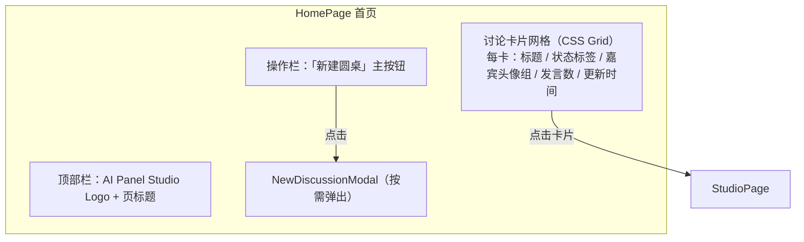
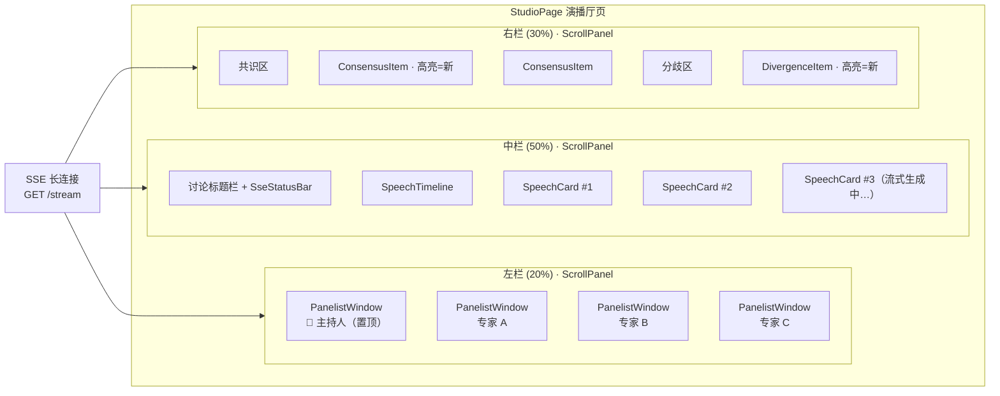
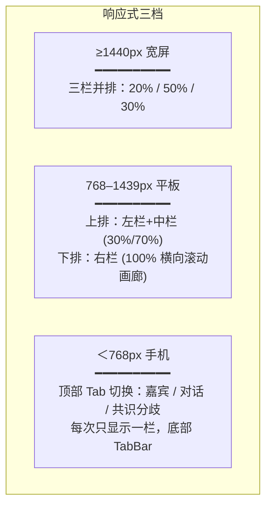
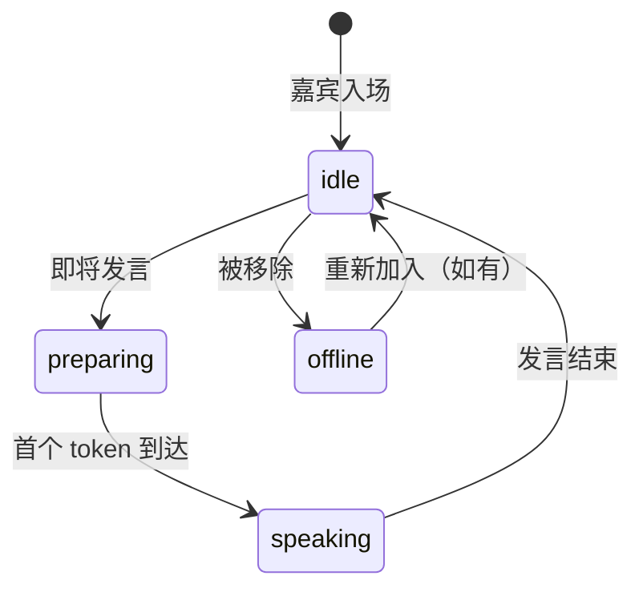

# AI Panel Studio — 前端架构设计方案

> 全中文界面 · 沉浸式圆桌演播厅 · 多端自适应 · 多会话状态隔离

---

## 一、组件分层总览

```
pages/                          ← 页面层（路由入口，组装布局，持有会话状态）
  ├─ HomePage                   ← 首页
  └─ StudioPage                 ← 演播厅讨论页

business/                       ← 业务 UI 组件层（领域语义，只拼基础组件 + 调接口）
  ├─ DiscussionCard             ← 讨论卡片
  ├─ NewDiscussionModal         ← 新建圆桌弹窗
  ├─ PanelistWindow             ← 嘉宾小窗（左栏）
  ├─ SpeechCard                 ← 单条发言卡片（中栏）
  ├─ SpeechTimeline             ← 发言时间线容器（中栏）
  ├─ ConsensusList              ← 共识列表（右栏）
  ├─ DivergenceList             ← 分歧列表（右栏）
  ├─ ConsensusItem              ← 单条共识条目
  ├─ DivergenceItem             ← 单条分歧条目
  └─ StudioLayout               ← 演播厅三栏布局壳

base/                           ← 基础通用组件层（无业务语义，纯 UI）
  ├─ ScrollPanel                ← 独立滚动容器
  ├─ ColorBadge                 ← 颜色标签/色块
  ├─ StatusIndicator            ← 状态指示灯
  ├─ Modal                      ← 通用弹窗
  ├─ SseStatusBar               ← SSE 连接状态条
  ├─ HighlightText              ← 高亮文本（新内容闪烁）
  └─ ResponsiveShell            ← 响应式外层壳
```

---

## 二、基础通用组件说明

### 2.1 ScrollPanel — 独立滚动容器

| 项 | 说明 |
|---|---|
| 用途 | 三栏每一栏的滚动容器，禁止整页滚动 |
| Props | — |
| 行为 | `overflow-y: auto`，高度由父级 `flex: 1` 撑满；滚动条 6px 宽深色半透明；触底/触顶不触发页面滚动 |
| 使用位置 | 左栏、中栏、右栏各包一个 |

### 2.2 ColorBadge — 颜色标签

| 项 | 说明 |
|---|---|
| 用途 | 标识嘉宾专属色，用于嘉宾窗口、发言卡片的色条 |
| Props | `color: string`（Hex），`size: 'sm' | 'md' | 'lg'`，`label?: string` |
| 渲染 | 左侧 4px 宽色条 + 可选文字，`border-radius: 2px` |

### 2.3 StatusIndicator — 状态指示灯

| 项 | 说明 |
|---|---|
| 用途 | 显示嘉宾实时状态 |
| Props | `status: PanelistStatus`（枚举见 §五）、`pulse: boolean`（是否呼吸动画） |
| 渲染 | 8px 圆点 + 动画。`idle` 灰色常亮，`preparing` 黄色脉冲，`speaking` 绿色呼吸 + 声纹波纹 |

### 2.4 Modal — 通用弹窗

| 项 | 说明 |
|---|---|
| 用途 | 新建讨论、确认删除等所有弹窗 |
| Props | `visible`, `title`, `width?`, `onClose`, 默认 slot |
| 行为 | 出场 `fadeIn` + `scale(0.95→1)`，遮罩点击关闭（可禁用），ESC 关闭 |

### 2.5 SseStatusBar — SSE 连接状态条

| 项 | 说明 |
|---|---|
| 用途 | 演播厅顶部或底部 2px 细条，显示 SSE 连接状态 |
| Props | `status: 'connected' | 'connecting' | 'disconnected'` |
| 渲染 | `connected`=绿色常亮，`connecting`=黄色闪烁，`disconnected`=红色 + 显示"点击重连" |

### 2.6 HighlightText — 高亮文本

| 项 | 说明 |
|---|---|
| 用途 | 共识/分歧面板中新到达/更新的条目背景闪烁 2 秒后消退 |
| Props | `highlight: boolean`，默认 slot |
| 行为 | `highlight=true` 时背景从品牌色渐变到透明，持续 2s，animation `highlightFade` |

### 2.7 ResponsiveShell — 响应式外壳

| 项 | 说明 |
|---|---|
| 用途 | 整个页面的最外层，处理三档断点切换 |
| 断点 | `≥1440px` 宽屏三栏、`768-1439px` 双栏堆叠、`＜768px` 单栏 Tab 切换 |

---

## 三、业务 UI 组件说明

### 3.1 DiscussionCard — 讨论卡片

| 项 | 说明 |
|---|---|
| 所属页面 | HomePage |
| 数据来源 | `GET /discussions` |
| 展示内容 | 标题（最多两行省略）、议题摘要（一行省略）、状态标签、嘉宾头像组（最多展示 4 个 + "等 N 人"）、发言数、最后更新时间 |
| 点击行为 | 路由跳转 `→ /studio/{discussion_id}` |
| 状态标签 | `active`=绿色"进行中"、`paused`=黄色"已暂停"、`completed`=灰色"已结束" |

### 3.2 NewDiscussionModal — 新建圆桌弹窗

| 项 | 说明 |
|---|---|
| 所属页面 | HomePage |
| 表单字段 | 讨论标题（必填，≤200字）、议题描述（选填，textarea） |
| 提交 | `POST /discussions` → 成功后关闭弹窗 → 刷新卡片列表 → 可选"直接进入演播厅" |
| 校验 | 标题为空时按钮置灰 + 红色提示文案 |

### 3.3 PanelistWindow — 嘉宾小窗

| 项 | 说明 |
|---|---|
| 所属区域 | 演播厅左栏 |
| 数据来源 | `GET /discussions/{id}/panelists` + SSE `speech.chunk` 更新状态 |
| 展示内容 | 头像（或姓名首字圆形替）、姓名、头衔（一行省略）、ColorBadge、StatusIndicator、最新一句发言（两行省略，灰色斜体） |
| 布局 | 垂直排列，每个小窗固定高度 120px，主持人置顶（橙色边框高亮） |
| 状态联动 | SSE `speech.chunk` 到达时对应嘉宾切换为 `speaking`，`speech.complete` 后切回 `idle` |

### 3.4 SpeechCard — 单条发言卡片

| 项 | 说明 |
|---|---|
| 所属区域 | 演播厅中栏（SpeechTimeline 内部） |
| 数据来源 | SSE `speech.complete` / `GET /discussions/{id}/speeches` |
| 展示内容 | ColorBadge（左侧 4px 色条）、发言人姓名 + 头衔、发言正文（支持段落换行）、发言时间（相对时间，如"3 分钟前"） |
| 入场动画 | 从下往上 `slideUp` 300ms |
| 流式预览 | `speech.chunk` 期间在时间线底部显示灰色半成品文本，打字机效果 |

### 3.5 SpeechTimeline — 发言时间线容器

| 项 | 说明 |
|---|---|
| 所属区域 | 演播厅中栏 |
| 数据来源 | SSE 实时推送 + 历史 GET 补拉 |
| 行为 | 新发言到达时自动滚到底部（如用户手动上滚查看历史则暂停自动滚动，出现"↓ 回到最新"浮动按钮） |
| 空态 | "讨论即将开始，嘉宾正在准备…" |

### 3.6 ConsensusItem / DivergenceItem — 共识/分歧条目

| 项 | 说明 |
|---|---|
| 所属区域 | 演播厅右栏 |
| 数据来源 | SSE `consensus.update` / `divergence.update` |
| 展示内容 | 主题（粗体）、内容、更新时间；分歧额外展示 `sides` 各方立场标签 |
| 高亮 | 新到达或刚更新的条目包裹 `HighlightText`，2 秒后消退 |
| 空态 | "暂未形成共识" / "暂未发现分歧"（灰色小字） |

### 3.7 StudioLayout — 演播厅三栏布局壳

| 项 | 说明 |
|---|---|
| 组成 | 左栏 `PanelistWindow` 列表 + 中栏 `SpeechTimeline` + 右栏 `ConsensusList` / `DivergenceList` |
| 栏宽比 | 宽屏 `1 : 2 : 1`（20% / 50% / 30%），平板双栏时右栏叠到下方，手机单栏 Tab |
| SSE 连接 | 在 `onMounted` 建立 `EventSource`，`onUnmounted` 关闭；状态传入 `SseStatusBar` |

---

## 四、页面布局 Mermaid 示意图

### 4.1 首页



### 4.2 演播厅页（三栏布局）



### 4.3 响应式断点布局变化



---

## 五、嘉宾状态枚举

| 枚举值 | 中文标签 | 指示灯 | 动画 | 触发条件 |
|---|---|---|---|---|
| `idle` | 待机 | 灰色圆点 `#95A5A6` | 无，常亮 | 初始状态 / 发言结束 2s 后自动切回 |
| `preparing` | 准备发言 | 黄色圆点 `#F39C12` | 慢脉冲（1.5s 周期） | 主持人点名该嘉宾、或 AI 已选定下一位发言人但尚未产出 token |
| `speaking` | 正在发言 | 绿色圆点 `#27AE60` | 呼吸 + 声纹波纹 | SSE 收到该嘉宾的 `speech.chunk`，持续至 `speech.complete` |
| `offline` | 已离场 | 无灯 | 嘉宾卡片半透明 | 嘉宾被手动移除（历史数据保留但标记离场） |

### 状态流转



---

## 六、状态管理设计

### 6.1 会话隔离策略

```
AppState
 └─ discussions: Map<discussion_id, DiscussionState>

DiscussionState (每个圆桌独立)
 ├─ info: Discussion           ← GET /discussions/{id}
 ├─ panelists: Panelist[]      ← GET .../panelists
 ├─ speeches: Speech[]         ← GET .../speeches + SSE 增量追加
 ├─ consensus: ConsensusPoint[] ← GET .../consensus + SSE 增量
 ├─ divergence: DivergencePoint[] ← GET .../divergence + SSE 增量
 ├─ sseStatus: SSEStatus       ← 'connecting' | 'connected' | 'disconnected'
 └─ generatingSpeech: boolean  ← 是否正在生成发言（防重复触发）
```

- 路由进入 `/studio/42` 时创建 `discussions.get(42)` 状态切片
- 路由离开时关闭该讨论的 SSE 连接，但状态保留在内存（短时间内返回无需重拉）
- 同时打开多个标签页分别进入不同讨论，各自状态切片互不干扰

### 6.2 SSE 事件 → 状态变更映射

| SSE 事件 | 状态变更 |
|---|---|
| `speech.chunk` | 更新对应 panelist 的 `status=speaking`；往当前生成中的 speech 追加 `delta` 文本 |
| `speech.complete` | `speeches.push(speech)`；对应 panelist `status→idle`；`generatingSpeech=false` |
| `consensus.update` | 若 `id` 已存在→替换更新；否则→`consensus.push()`；标记该条目 `highlight=true`，2s 后复原 |
| `divergence.update` | 同上逻辑 |
| `error` | Toast 提示错误消息；`generatingSpeech=false`；可重试 |
| `heartbeat` | 更新 `sseStatus='connected'`（如之前为 `disconnected` 则说明已恢复） |

---

## 七、组件树（完整嵌套关系）

```
<ResponsiveShell>                              ← base
  │
  ├─ [路由: /]
  │   └─ <HomePage>                            ← page
  │       ├─ <DiscussionCard /> × N            ← business
  │       │   └─ <ColorBadge /> × N            ← base（头像缺省时）
  │       └─ <NewDiscussionModal>              ← business
  │           └─ <Modal>                        ← base
  │
  └─ [路由: /studio/:discussion_id]
      └─ <StudioPage>                          ← page
          ├─ <SseStatusBar status={sseStatus} /> ← base
          └─ <StudioLayout>                     ← business
              │
              ├─ 左栏 <ScrollPanel>             ← base
              │   └─ <PanelistWindow /> × N     ← business
              │       ├─ <ColorBadge />          ← base
              │       └─ <StatusIndicator />     ← base
              │
              ├─ 中栏 <ScrollPanel>             ← base
              │   └─ <SpeechTimeline>           ← business
              │       └─ <SpeechCard /> × N     ← business
              │           └─ <ColorBadge />      ← base
              │
              └─ 右栏 <ScrollPanel>             ← base
                  ├─ <ConsensusList>            ← business
                  │   └─ <ConsensusItem /> × N  ← business
                  │       └─ <HighlightText />   ← base
                  └─ <DivergenceList>           ← business
                      └─ <DivergenceItem /> × N ← business
                          └─ <HighlightText />   ← base
```

---

## 八、断点与布局行为表

| 断点范围 | 设备 | 左栏（嘉宾） | 中栏（发言） | 右栏（共识/分歧） | 导航方式 |
|---|---|---|---|---|---|
| `≥1440px` | 宽屏显示器 | 固定左侧 20% | 中间 50% | 右侧 30% | 三栏同时可见，各自独立滚动 |
| `768–1439px` | 笔记本/平板 | 左上 30% | 右上 70% | 底部全宽，横向滚动画廊 | 上排 + 下排；底部内容卡片水平滑动 |
| `＜768px` | 手机 | Tab1 | Tab2 | Tab3 | 顶部三 Tab 切换，每次只显示一栏；底部固定 `SseStatusBar` + 触发发言按钮 |

### 手机端额外适配

- 左栏面板：`PanelistWindow` 高度压缩为 80px，头像缩小为 32px，头衔省略为一行
- 中栏发言：`SpeechCard` 左边色条缩为 3px，正文字号 14px
- 右栏面板：共识/分歧条目取消分栏，垂直堆叠，`sides` 标签水平滚动
- 触发发言按钮：FAB（右下角圆形按钮 "下一轮"），半透明深色背景，不遮挡内容
